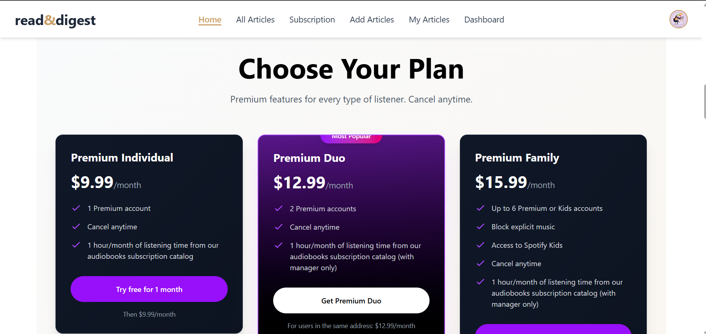

# Newspaper FullStack Website - Client

Welcome to the **Newspaper FullStack Website** frontend! This is a dynamic news aggregation platform built with **React**, **Firebase**, **React Router**, **Tailwind CSS**, and **TanStack Query**, designed to deliver trending and premium news articles seamlessly.

## Admin Credentials (For testing)
- **Email:** admin@example.com  
- **Password:** Admin@123  

## Live Site
[Live Demo Link](newspaper-fullstack-webs-53e81.web.app)

## Key Features
1. Responsive design for **mobile, tablet, and desktop**.
2. **Private routes** for Add Articles, Subscription, Dashboard, My Articles, Profile Page, and Premium Articles.
3. **JWT authentication** with localStorage to keep users logged in on reload.
4. Navbar dynamically updates based on **user authentication** status.
5. Trending articles displayed in a **slider**, calculated by total views.
6. Full **CRUD functionality** for articles with proper **toast/sweet alert notifications**.
7. Search and filter articles by **publisher and tags** on All Articles page.
8. Premium users can post **unlimited articles**, normal users limited to 1.
9. **Subscription modal** on homepage after 10 seconds for non-premium users.
10. **Dynamic homepage statistics** using react-countup.
11. Add Publisher feature for admins with **image upload via imgbb/Cloudinary**.
12. Detailed Article page with **view count tracking**.
13. **404 Page** for unmatched routes.
14. Optional animations using **GSAP** and **typewriter effect** on homepage.
15. Dynamic page titles and relevant favicon.

## Tech Stack
- React (frontend framework)
- Firebase (Authentication)
- React Router (Routing)
- Tailwind CSS (Styling)
- TanStack Query (Data fetching)
- react-hot-toast / sweetalert2 (Notifications)
- react-simple-typewriter (Typewriting effect)
- react-countup (Statistics)
- Axios (HTTP requests)

## 📸 Screenshots

### Home Page


### Discover Articles


### Dashboard


## Installation
1. Clone the repository:  
```bash
git clone <https://github.com/chaitey23/Library-management-client>
